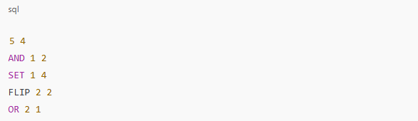
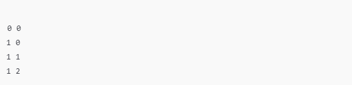

# Desafio de código com uso da classe BitSet

Esse desafio requer o uso da classe BitSet do Java, que permite manipular bits de maneira eficiente em termos de espaço.

## Descrição do Problema
- Você possui dois BitSets 𝐵1 e 𝐵2 de tamanho 𝑛, onde todos os bits inicialmente estão em 0.
- O objetivo é realizar uma série de 𝑚 operações nesses BitSets.
- Após cada operação, deve-se imprimir o número de bits definidos como 1 em 𝐵1 e 𝐵2 (isto é, os "bits setados").

## Formato de Entrada
1. A primeira linha contém dois inteiros, 𝑛 (tamanho dos BitSets) e 𝑚 (quantidade de operações).
2. As próximas 𝑚 linhas contêm uma das seguintes operações:
   - AND <1 ou 2> <1 ou 2>: faz o "E lógico" entre os BitSets e salva o resultado no primeiro operando.
   - OR <1 ou 2> <1 ou 2>: faz o "OU lógico" entre os BitSets e salva o resultado no primeiro operando.
   - XOR <1 ou 2> <1 ou 2>: faz o "OU exclusivo" entre os BitSets e salva o resultado no primeiro operando.
   - FLIP <1 ou 2> <index>: inverte o valor do bit no índice especificado do BitSet escolhido.
   - SET <1 ou 2> <index>: define o bit no índice especificado como 1 no BitSet escolhido.

## Formato de Saída
Para cada operação, exiba o número de bits 1 em 𝐵1 e 𝐵2 como dois inteiros separados por um espaço.

### Exemplo
- Entrada:\

- Saída:\

